# Hi there, I'm lich4! 👋

**安全工程师 | 逆向分析爱好者 | 全栈开发者**

💻 前端、后台、移动端、桌面端的全栈开发能力

  
  

---

### 🛠️ 专注领域
- **安全与逆向**：逆向分析、应用安全、iOS越狱/巨魔开发、LLVM/OLLVM混淆
- **主要语言**：C/C++, Objective-C, Python, Vue, Javascript

### 📌 重点开源项目
- 📦 **[JBDev](https://github.com/lich4/JBDev)**：基于 Xcode 的越狱/TrollStore 插件开发框架（Theos 的下一代方案）。
- 🔋 **[ChargeLimiter](https://github.com/lich4/ChargeLimiter)**：iOS 充电限制工具（灵感源自 macOS 的 AlDente）。
- 🛡️ **[ollvm-pass](https://github.com/lich4/ollvm-pass)**：独立的 Hikari OLLVM 混淆 Pass。
- 🔧 **[personal_script](https://github.com/lich4/personal_script)**：日常技术研究与全栈脚本合集。

### 📫 找到我
- 🌐 **技术博客**：[lich4.github.io](https://lich4.github.io)
- 💬 **个人 QQ**：571652571
- 👥 **技术交流群**：560017652 (QQ群)

---
